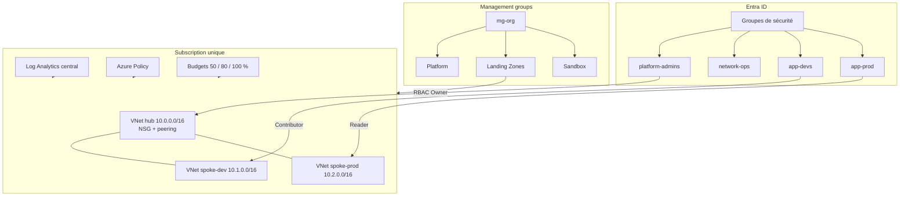

# Socle Azure — landing zone

Gouvernance, réseau hub-and-spoke, identités, supervision et coûts, reproductibles avec Terraform. Les équipes applicatives se branchent sur les spokes **dev** et **prod** ; elles ne créent plus d’abonnements « comme elles veulent ».

> Compte Azure gratuit : **une seule subscription**. Les management groups existent quand même. Dev et prod sont des **resource groups** (et des VNets), pas des abonnements séparés. C’est suffisant pour une soutenance.

## Architecture



Détail : [docs/architecture.md](docs/architecture.md). Coûts : [docs/couts.md](docs/couts.md). Démo policy : [docs/demo-soutenance.md](docs/demo-soutenance.md).

## Ordre de déploiement (important)

1. **Alerte budget** — premier apply (`bootstrap/`), avant le reste.
2. Backend Terraform (Storage Account + container `tfstate`).
3. Socle (`infra/`) : MG, RG, réseau, policies, identités, monitoring.
4. Pipeline GitHub Actions (OIDC, **aucun secret Azure dans GitHub**).

Ne pas activer `enable_expensive_network` (Azure Firewall) ni `enable_defender_standard` sur le crédit gratuit, sauf démo courte suivie de `terraform destroy`.

## Prérequis machine

| Outil | Rôle |
| --- | --- |
| Terraform >= 1.6 | IaC |
| Azure CLI (`az`) | Authentification locale |
| Git | Dépôt |
| VS Code + extensions Terraform et Azure | Édition |
| Compte Azure gratuit + tenant Entra ID | Cible |

Installation (Windows, PowerShell en admin) :

```powershell
winget install HashiCorp.Terraform
winget install Microsoft.AzureCLI
az login
az account show
```

### Élévation d’accès (management groups)

1. Entra ID → **Properties** → **Access management for Azure resources** → Yes (Global Administrator).
2. Portail Azure → **Management groups** → créer / rafraîchir.
3. Revenir ensuite à un compte opérationnel ; ne pas rester élevé en permanence.

Si l’élévation n’est pas possible : `enable_management_groups = false` dans `infra/terraform.tfvars`. Les policies s’appliquent quand même à la subscription.

## Déploiement local

```powershell
cd socle-azure

copy bootstrap\terraform.tfvars.example bootstrap\terraform.tfvars
# Éditer subscription_id, emails, budget_start_date = 1er du mois UTC (ex. 2026-09-01T00:00:00Z)

cd bootstrap
terraform init
terraform apply   # budget + storage de state → écrit infra/backend.hcl

cd ..\infra
copy terraform.tfvars.example terraform.tfvars
# Même subscription / tenant / emails

terraform init -backend-config=backend.hcl
terraform plan
terraform apply
```

## GitHub Actions (OIDC)

Voir [docs/github-oidc.md](docs/github-oidc.md). Résumé :

- App registration + federated credentials (`main`, `pull_request`, environment `production`).
- Rôle **Contributor** (et User Access Administrator si MG) sur la subscription, **sans** client secret.
- Variables GitHub (`vars.*`), pas de secrets ARM.
- PR : `fmt`, tflint, Checkov, `terraform plan` commenté.
- Apply : **Actions → socle-azure → Run workflow** après approbation de l’environnement `production`.

## Ce que le socle impose

| Domaine | Contrôle |
| --- | --- |
| Régions | West Europe, France Central uniquement |
| Tags | `Environment`, `Owner`, `CostCenter` obligatoires |
| Exposition | Interdiction `Microsoft.Network/publicIPAddresses` |
| Chiffrement | Storage : HTTPS / TLS 1.2 (deny si transfert non sécurisé) |
| Réseau | Hub partagé, spokes dev/prod, peering, NSG, UDR `0.0.0.0/0` |
| Identités | Groupes Entra, RBAC **uniquement** sur les groupes |
| Supervision | Log Analytics + diagnostic settings (Terraform + policy DINE) |
| Defender | Contact + CSPM Free ; plans Standard optionnels |
| Coûts | Budgets subscription + chaque RG, seuils 50 / 80 / 100 % |

## Structure du dépôt

```
bootstrap/     # 1. budget + tfstate
infra/         # 2. socle
modules/budget/
docs/
scripts/       # démo policy + OIDC
.github/workflows/terraform.yml
```

## Destruction

```powershell
cd infra
terraform destroy
cd ..\bootstrap
terraform destroy
```

Le budget bootstrap disparaît avec le second destroy : surveille Cost Management tant que des ressources restent.
