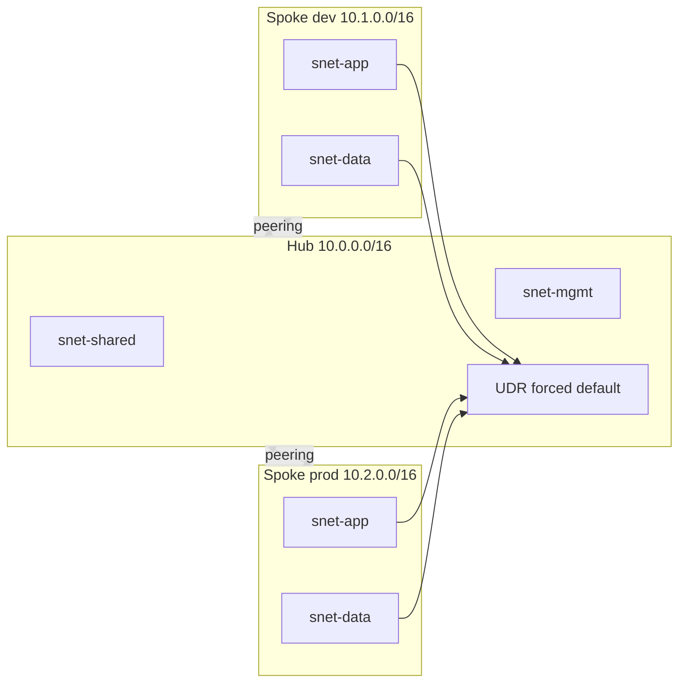

# Architecture — socle Azure

## Décisions

| Sujet | Choix | Pourquoi |
| --- | --- | --- |
| Subscriptions | 1 abonnement, 6 resource groups | Limite du compte gratuit ; la hiérarchie MG reste visible |
| Réseau | Hub-and-spoke + peering | Les apps ne créent pas leur VNet isolé ; le hub est le point d’échange |
| Sortie Internet | Table de routage `0.0.0.0/0` → `None` | « Forced tunneling » sans Azure Firewall (coût horaire) |
| Firewall / Bastion / VPN | Désactivés par défaut | Crédit 200 $ ; NSG + UDR suffisent à la démo |
| RBAC | Groupes Entra uniquement | Traçabilité, pas de droits nominatifs |
| State | Storage Account, blob privé, versioning | Backend distant, pipeline OIDC |
| Policy | Assignations **subscription** | Fonctionne même si les MG ne sont pas créés |

## Hiérarchie

```
Tenant Root Group
└── mg-{org}                          # racine métier
    ├── Platform                      # identité, connectivité, management (cibles futures)
    ├── Landing Zones                 # ← subscription rattachée ici
    │     RG connectivity  → VNet hub
    │     RG lz-dev        → VNet spoke-dev
    │     RG lz-prod       → VNet spoke-prod
    │     RG management    → Log Analytics
    │     RG identity      → (réservé)
    └── Sandbox                       # RG sandbox, Contributor pour expérimenter
```

## Plan d’adressage

| Réseau | CIDR | Subnets |
| --- | --- | --- |
| Hub | 10.0.0.0/16 | `snet-shared` 10.0.0.0/24, `snet-mgmt` 10.0.1.0/24, `AzureFirewallSubnet` 10.0.2.0/26 si démo Firewall |
| Spoke dev | 10.1.0.0/16 | `snet-app` 10.1.1.0/24, `snet-data` 10.1.2.0/24 |
| Spoke prod | 10.2.0.0/16 | `snet-app` 10.2.1.0/24, `snet-data` 10.2.2.0/24 |

Peerings bidirectionnels, `allow_forwarded_traffic = true`.

## Flux de contrôle

1. Une équipe applicative demande l’accès au groupe `app-devs` (jamais un rôle Azure sur son compte).
2. Elle déploie dans `rg-*-lz-dev-weu` / spoke-dev, régions et tags imposés par Policy.
3. Une Public IP ou une région `eastus` est **refusée** à l’ARM (effet Deny).
4. Les NSG envoient les logs vers le workspace central (paramètres de diagnostic + policy DeployIfNotExists).
5. Cost Management notifie à 50 %, 80 % et 100 % du budget du périmètre.

## Schéma réseau


